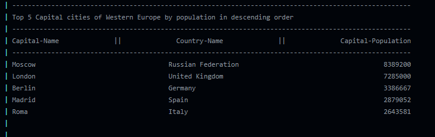

# Project Badges
* Build Status Master   

* Build Status Develop 

* Licence   

* Release   

* Code Coverage   

# Requirement Status
32/32 requirements have been implemented, which is 100%

| ID  | Name | Met | Screenshot |
|-----|------|-----|------------|
| 1 | All the countries in the world organised by largest population to smallest. | Yes |  |  
| 2 | All the countries in a continent organised by largest population to smallest. | Yes |  |  
| 3 | All the countries in a region organised by largest population to smallest. | Yes |  |  
| 4 | The top N populated countries in the world where N is provided by the user. | Yes |  |  
| 5 | The top N populated countries in a continent where N is provided by the user. | Yes |  |  
| 6 | The top N populated countries in a region where N is provided by the user. | Yes |  |  
| 7 | All the cities in the world organised by largest population to smallest. | Yes |  |  
| 8 | All the cities in a continent organised by largest population to smallest. | Yes |  |  
| 9 | All the cities in a region organised by largest population to smallest. | Yes |  |  
| 10 | All the cities in a country organised by largest population to smallest. | Yes |  |  
| 11 | All the cities in a district organised by largest population to smallest. | Yes |  |  
| 12 | The top N populated cities in the world where N is provided by the user. | Yes |  |  
| 13 | The top N populated cities in a continent where N is provided by the user. | Yes |  |  
| 14 | The top N populated cities in a region where N is provided by the user. | Yes |  |  
| 15 | The top N populated cities in a country where N is provided by the user. | Yes |  |  
| 16 | The top N populated cities in a district where N is provided by the user. | Yes |  |  
| 17 | All the capital cities in the world organised by largest population to smallest. | Yes |  |  
| 18 | All the capital cities in a continent organised by largest population to smallest. | Yes |  |  
| 19 | All the capital cities in a region organised by largest to smallest. | Yes |  |  
| 20 | The top N populated capital cities in the world where N is provided by the user. | Yes |  |  
| 21 | The top N populated capital cities in a continent where N is provided by the user. | Yes |  |  
| 22 | The top N populated capital cities in a region where N is provided by the user. | Yes |  |  
| 23 | The population of people, people living in cities, and people not living in cities in each continent. | Yes |  |  
| 24 | The population of people, people living in cities, and people not living in cities in each region. | Yes |  |  
| 25 | The population of people, people living in cities, and people not living in cities in each country. | Yes |  |  
| 26 | The population of the world. | Yes |  |  
| 27 | The population of a continent. | Yes |  |  
| 28 | The population of a region. | Yes |  |  
| 29 | The population of a country. | Yes |  |  
| 30 | The population of a district. | Yes |  |  
| 31 | The population of a city. | Yes |  |  
| 32 | the number of people who speak the following the following languages from greatest number to smallest: Chinese. English. Hindi. Spanish. Arabic. | Yes |  |  

